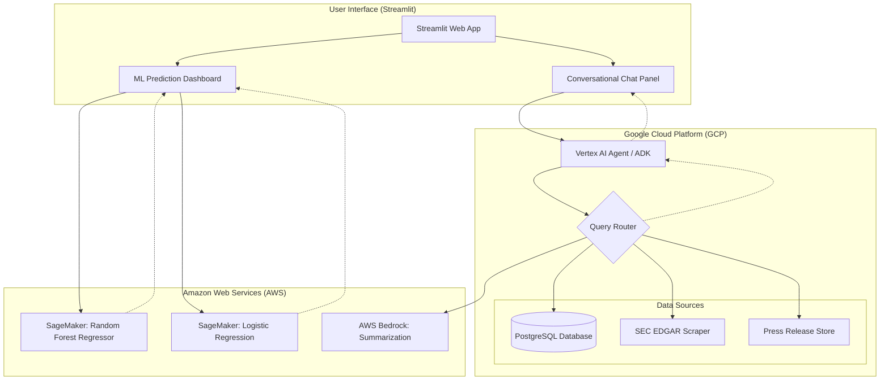

# Real Estate Financial Assistant

The project integrates **GCP Vertex AI**, **AWS SageMaker**, and **PostgreSQL** to provide real-time property insights and investment risk assessments. It demonstrates a hybrid-cloud approach to financial auditing and predictive modeling.

## Key Features

* **AI Agent Orchestrator**: Built on the Vertex AI Agent Development Kit (ADK) to route queries between local data and external sources.
* **Property Value Sage**: A Random Forest Regressor that predicts property values based on California Housing data.
* **Investment Risk Sage**: A Logistic Regression Classifier that assesses loan/investment risk levels.
* **External Data Integration**: Automated scraping of official **U.S. SEC (Securities and Exchange Commission)** 10-K filings.
* **Local Data Intelligence**: A robust PostgreSQL database housing 20+ specialized real estate asset records.

---

## Project Structure

```text
financial-assistant-project/
├── app.py                     # Main Streamlit UI
├── financial_agent.py         # AI Agent logic & Vertex AI routing
├── sec_tools.py               # SEC EDGAR scraper utility
├── requirements.txt           # Project dependencies
├── .gitignore                 # Version control exclusions
├── notebooks/                 # Model development & data cleansing
│   ├── train_bank_classifier.ipynb
│   └── train_housing_regressor.ipynb
├── artifacts/                 # Trained ML models & scalers
│   ├── bank_classifier.joblib
│   ├── bank_scaler.joblib
│   ├── housing_regressor.joblib
│   └── housing_scaler.joblib
├── data/                      # Database initialization
│   └── init_db.sql            # PostgreSQL schema and 20+ records
└── venv/                      # Local virtual environment
```

## Tech Stack

| Component     | Technology                                       |
|---------------|--------------------------------------------------|
| Frontend      | Streamlit (Multi-column layout)                  |
| Orchestration | GCP Vertex AI (Agentic Workflow)                 |
| ML Inference  | AWS SageMaker / Scikit-Learn                     |
| Database      | PostgreSQL                                       |
| Data Sources  | SEC EDGAR API, California Housing Dataset        |

## Setup & Installation
1. Environment Setup

```PowerShell
git clone <your-repo-link>
cd financial-assistant-project
.\venv\Scripts\activate
```

# Install dependencies
```python
pip install -r requirements.txt
```

2. Database Initialization

Ensure your local PostgreSQL service is running, then execute the initialization script:

```PowerShell
psql -U postgres -d real_estate_corp -f data/init_db.sql
```

3. Running the Application

```PowerShell
streamlit run app.py
```

## Machine Learning Solutions

The project includes two distinct ML solutions developed in Jupyter Notebooks to handle core financial predictions:

Housing Regressor (RandomForestRegressor): Handles continuous numerical prediction for property market value based on historical California housing metrics.

Bank Classifier (LogisticRegression): Performs binary classification to categorize investment risk as "Low" or "High" based on credit scores and debt-to-income ratios.

Both models utilize specialized Scalers stored in the /artifacts folder to ensure data consistency between training and production inference.

## External Data Usage

This application identifies itself to the SEC via a registered User-Agent to fetch 10-K filings. This data allows the AI Agent to perform "grounded" financial analysis on 

public companies alongside private real estate data, fulfilling the requirement for external financial data integration.

