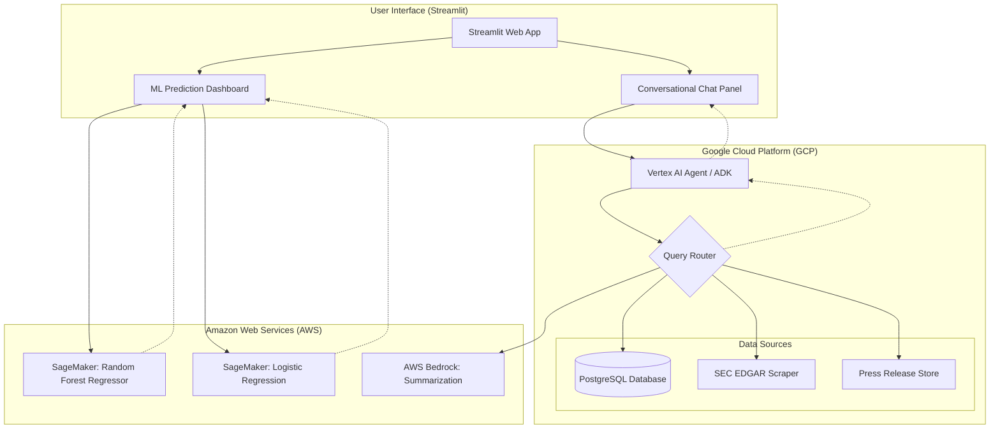

```mermaid
graph TD
    subgraph "User Interface (Streamlit)"
        UI[Streamlit Web App]
        Chat[Conversational Chat Panel]
        ML_Dash[ML Prediction Dashboard]
    end

    subgraph "Google Cloud Platform (GCP)"
        Vertex[Vertex AI Agent / ADK]
        Router{Query Router}
        
        subgraph "Data Sources"
            DB[(PostgreSQL Database)]
            SEC[SEC EDGAR Scraper]
            Press[Press Release Store]
        end
    end

    subgraph "Amazon Web Services (AWS)"
        Sage_Reg[SageMaker: Random Forest Regressor]
        Sage_Class[SageMaker: Logistic Regression]
        Bedrock[AWS Bedrock: Summarization]
    end

    %% Interactions
    UI --> Chat
    UI --> ML_Dash
    
    Chat --> Vertex
    Vertex --> Router
    
    Router --> DB
    Router --> SEC
    Router --> Press
    Router --> Bedrock
    
    ML_Dash --> Sage_Reg
    ML_Dash --> Sage_Class
    
    %% Response Flow
    Router -.-> Vertex
    Vertex -.-> Chat
    Sage_Reg -.-> ML_Dash
    Sage_Class -.-> ML_Dash
```